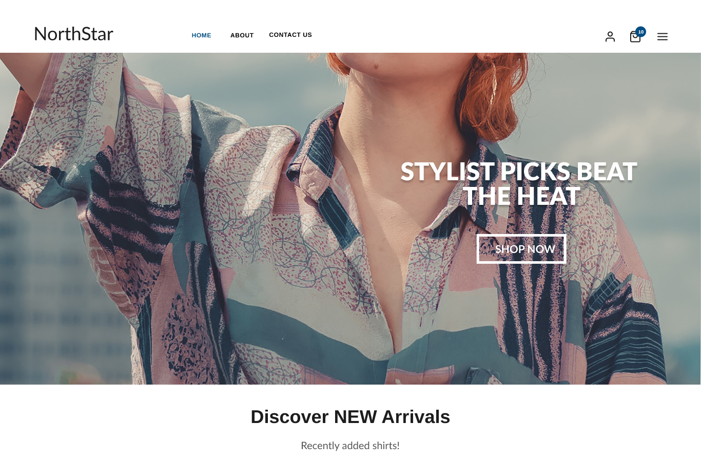

# Examen progreso 1 - Gabriel Calderón

Este repositorio es el modelo enviado y replicado con elementos nativos de html css, pero siguiendo el framework BEM e implementando SASS.

> Algunos tamaños dentro del proyecto se han cambiado para que adapte mejor a pantallas de 1980 x 1080.

Se han subido los siguientes archivos:
| Archivo | Descripción |
|---------|-------------|
| index.html | código fuente de la página|
| css/reset.css | encargado de establecer margenes en 0 |
| css/style.scss | código de SASS que se compila a css |
| css/style.css | código compliado que es al que hace referencia el index|
| img/... | imagenes de la página|
